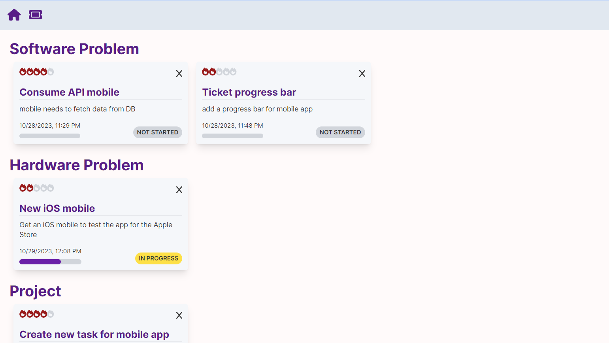

## Getting Started

### To run the application, follow these steps:

### 1. Install the required dependencies by running `npm install` in the project directory.

### 2. Create a MongoDB database and add the connection string to the .env file. (See the .env.example file for an example.)

### 3. Start the development server by running `npm run dev`.

### 4. Open the application in your browser at http://localhost:3000.

